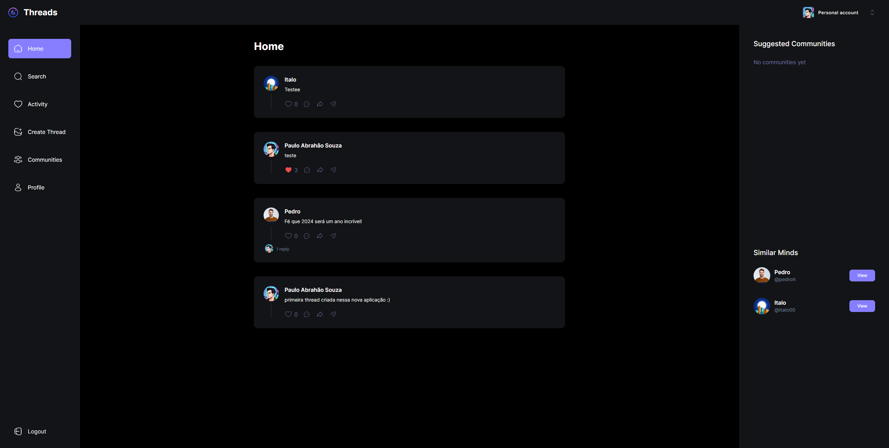
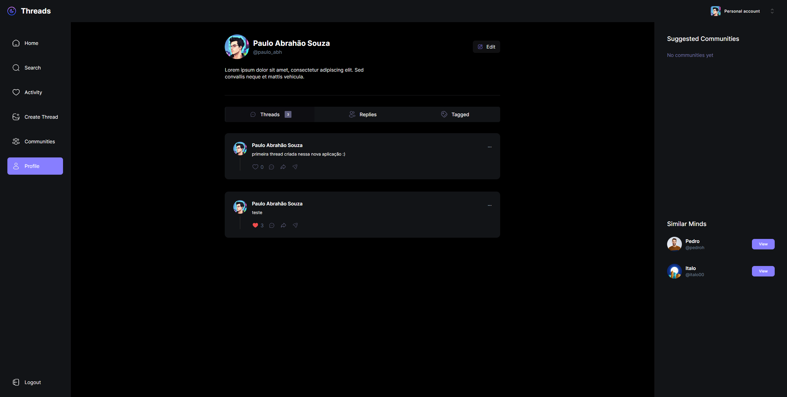
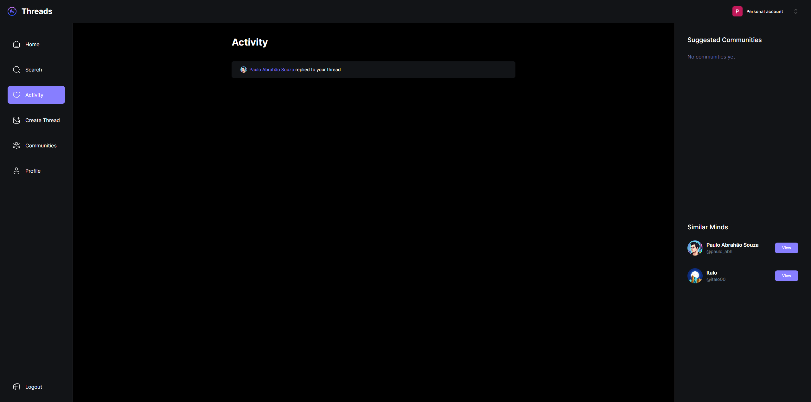
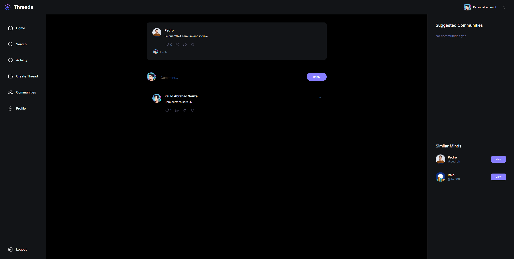

# Threads Clone

<h2> Sobre </h2>
<h3> Clone da rede social Threads desenvolvido com Next Js e MongoDB. </h3>

## Instalação

Para rodar essa aplicação em sua máquina, primeiro clone o repositório:

```bash
  git clone https://github.com/PauloAbrahao/Threads-Clone.git
```

Então, navegue para o repositório e instale as dependências:

```bash
  cd threads
```

```bash
  npm install
```

Finalmente, inicie a aplicação:

```bash
  npm run dev
```

<p align="center">
  
  
  
  
</p>

## 💻 Tecnologias usadas nesse projeto:

- Next.js
- MongoDB
- Shadcn UI
- TailwindCSS
- Clerk
- Webhooks
- Serverless APIs
- React Hook Form
- Zod
- TypeScript
